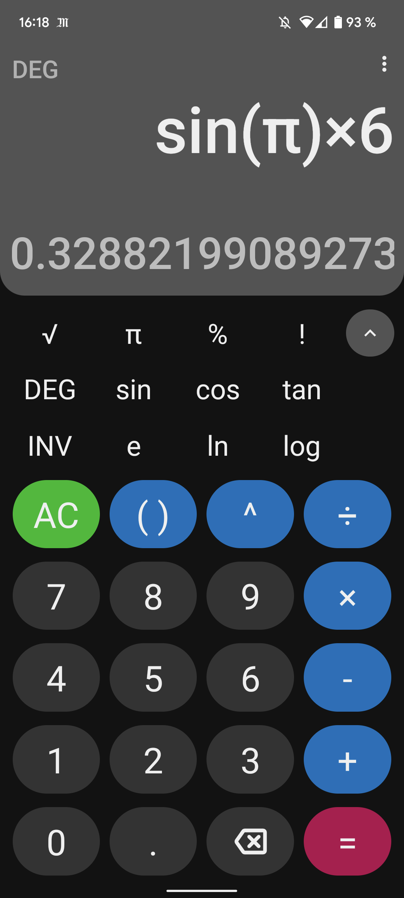
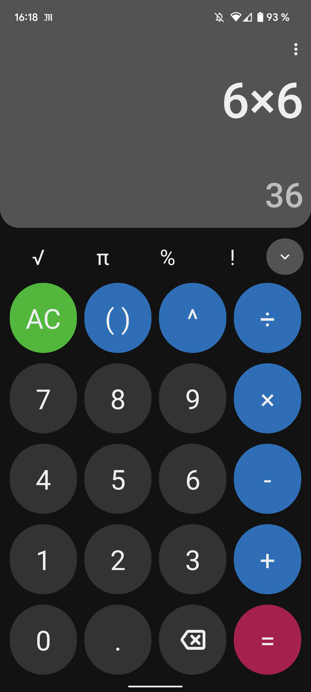
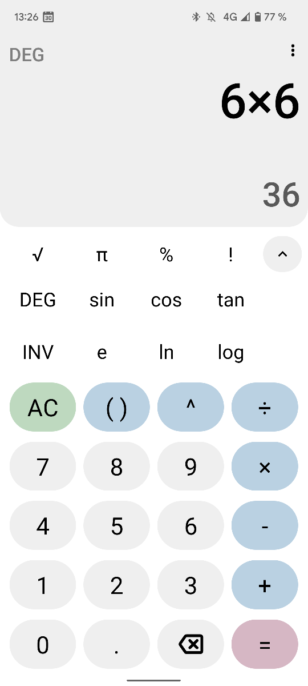
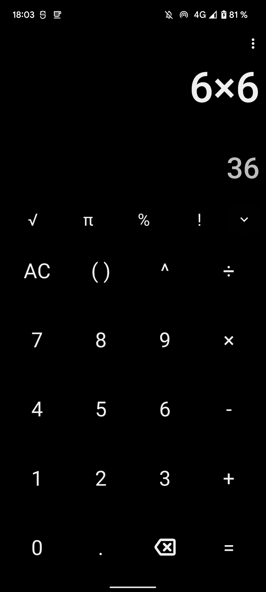
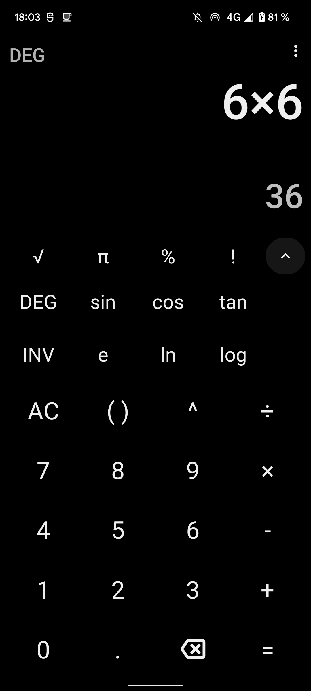

# OpenCalc

### A simple and beautiful calculator for Android.

 

 

## 📖 Features

* Lightweight (~2MB),
* No unnecessary permissions,
* Dark, Light, Amoled and Material You theme,
* Scientific mode,
* History,
* Portrait and landscape orientation,
* More...

## 📷 Screenshots

## ☕ Support

Support OpenCalc development by donating money. Thank you very much for your help! ❤️

  

## 💬 Discord

Join the Discord server!

## 🔨 Contributing

Pull requests are welcome. For major changes, please open an issue first to discuss what you would like to change.

Please make sure to update tests as appropriate.

## 🌎 Translations

You can help translate OpenCalc on [Hosted Weblate](https://hosted.weblate.org/engage/opencalc/).

<h3 align="center">Translation status</h3>

## 📜 License

This project is licensed under [GPLv3](/LICENSE)

## 🫶 Contributors

